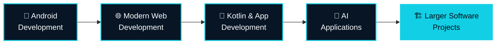
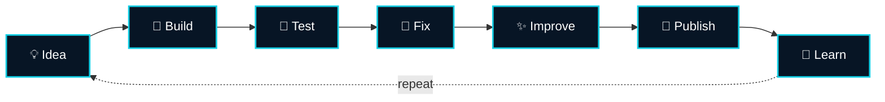

 

  

## 👋 Hello, I'm Heet

I'm **Heet Shah**, a BCA student and independent developer from **Bhavnagar, Gujarat** 🇮🇳

I enjoy building practical software projects and learning by creating real things. Everything I build lives under **HeetDevLab**.

| 📱 Android Apps | 🌐 Web Projects | 🛠️ Browser Utilities |
|:---:|:---:|:---:|
| **🤖 AI Concepts** | **🔐 Privacy Software** | **💡 Indie Projects** |

## 🌐 About This Repository

This repository contains my personal developer portfolio, showcasing my projects, technical skills, development work, learning journey and developer profile.

## ⚡ Tech Stack

**Programming**

**Web**

**Android & Development**

## 🚀 Featured Projects

### 🔐 Sentinex

**Privacy-focused Android application**

Sentinex protects selected apps and provides privacy-oriented features.

| 🔒 App Lock | 👤 Intruder Detection | 👻 Ghost Mode | 🔢 PIN Protection | 🛡️ App Protection |
|:---:|:---:|:---:|:---:|:---:|

---

### 🛠️ HeetDevLab WebTools

A collection of useful browser-based utilities.

<b>🔽 See all tools</b>

 

- 🔑 Password Generator
- 🔢 PIN Generator
- 📝 Secure Notes
- #️⃣ Hash Generator
- 🔍 Hash Compare
- 🔐 JWT utilities
- 🛡️ Password Strength Checker

---

### 🤖 Nexora

**AI assistant project, currently in development**

Nexora explores ideas around AI interaction, task automation, scheduling, device interaction, memory and AI-assisted workflows.

> 🚧 Nexora is currently a work in progress.

## 🎓 Education

**Bachelor of Computer Applications (BCA)**
🏫 Shree Swaminarayan College of Computer Science, Bhavnagar
🎓 Affiliated with MKBU University

| Semester | SGPA |
|:---:|:---:|
| 📘 Semester 1 | **6.95** |
| 📗 Semester 2 | **7.00** |

## 📚 Current Learning

I continuously improve by building, testing, fixing and publishing projects.

## 🔥 Development Philosophy

### Build first. Learn from it. Improve it.

## 📊 GitHub

  

  

## 🌐 Connect

  

### 💙 Thanks for visiting my portfolio repository

**Heet Shah • HeetDevLab**

